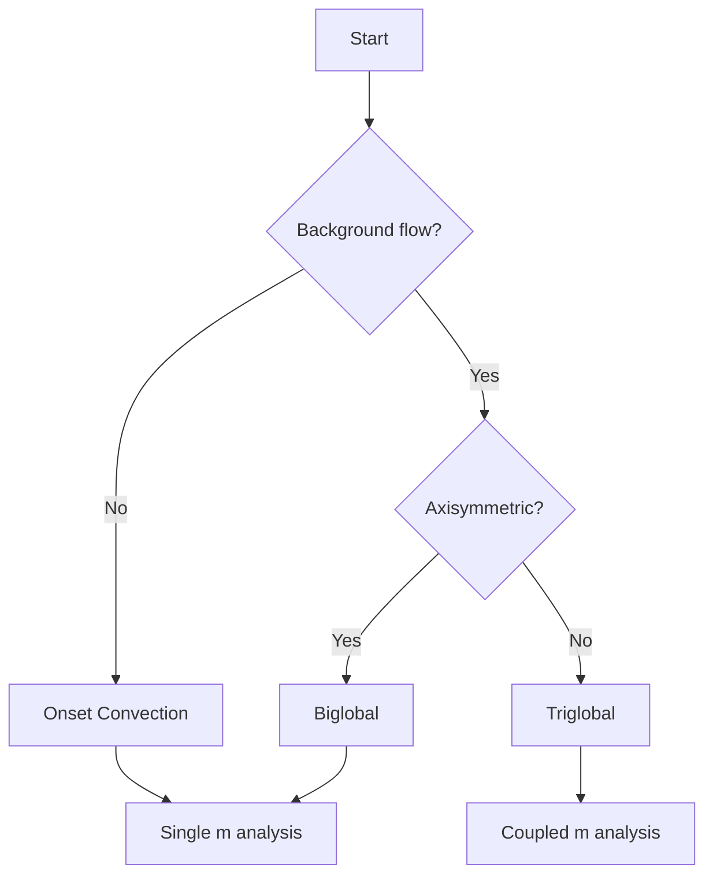

# Analysis Modes

Cross.jl provides three progressively complex approaches for linear stability analysis, each tailored to different physical scenarios involving background mean flows.

## Overview

| Analysis Mode | Basic State | Mode Coupling | Use Case |
|---------------|-------------|---------------|----------|
| **[Onset Convection](onset_convection.md)** | Conduction only ($\bar{\mathbf{u}} = 0$) | None | Classical convection onset |
| **[Biglobal](biglobal_stability.md)** | Axisymmetric ($m = 0$) | None | Thermal wind, zonal jets |
| **[Triglobal](triglobal_stability.md)** | Non-axisymmetric ($m \neq 0$) | Yes | CMB heterogeneity, tidal forcing |

## Choosing the Right Analysis Mode



### Onset Convection (No Mean Flow)

**Physical scenario**: Pure thermal convection in a rotating shell with a conductive temperature profile and no pre-existing flows.

**Key characteristics**:

- Base state: $\bar{T}(r)$ conductive profile, $\bar{\mathbf{u}} = 0$
- Each azimuthal mode $m$ is independent
- Seek critical Rayleigh number $Ra_c(m)$ and minimum over $m$
- Thermal Rossby waves with prograde drift

**Typical applications**:

- Planetary core convection onset
- Laboratory rotating convection experiments
- Fundamental scaling law verification

[Learn more about Onset Convection](onset_convection.md){ .md-button }

---

### Biglobal (Axisymmetric Mean Flow)

**Physical scenario**: Stability analysis when the background has latitudinal (but not longitudinal) structure, such as thermal wind driven by pole-equator temperature differences.

**Key characteristics**:

- Base state: $\bar{T}(r, \theta)$, $\bar{u}_\phi(r, \theta)$ with $m = 0$ components only
- Each perturbation mode $m$ still independent
- Mean flow advection modifies growth rates and drift
- Zonal flow can stabilize or destabilize

**Typical applications**:

- Earth's core with CMB heat flux variations (axisymmetric part)
- Differentially rotating boundaries
- Thermal wind studies

[Learn more about Biglobal Analysis](biglobal_stability.md){ .md-button }

---

### Triglobal (Non-Axisymmetric Mean Flow)

**Physical scenario**: Full 3D stability when the background breaks longitudinal symmetry, introducing mode coupling between different azimuthal wavenumbers.

**Key characteristics**:

- Base state: $\bar{T}(r, \theta, \phi)$, $\bar{\mathbf{u}}(r, \theta, \phi)$ with $m \neq 0$
- Perturbation modes couple: $m \leftrightarrow m \pm m_{bs}$
- Block matrix structure with coupling through Gaunt coefficients
- Significantly larger computational cost

**Typical applications**:

- Earth's core with full CMB heat flux heterogeneity
- Mercury's 3:2 spin-orbit resonance
- Tidally forced bodies (Io, Europa)
- Stars with active regions

[Learn more about Triglobal Analysis](triglobal_stability.md){ .md-button }

---

## Comparison Summary

### Mathematical Complexity

| Aspect | Onset | Biglobal | Triglobal |
|--------|-------|----------|-----------|
| Basic state $m$ values | 0 | 0 | 0, $\pm 1$, $\pm 2$, ... |
| Advection terms | $u'_r \cdot \nabla \bar{T}$ | + $\bar{\mathbf{u}} \cdot \nabla \mathbf{u}'$ | + mode coupling |
| Matrix structure | Block diagonal | Block diagonal | Block tridiagonal (or wider) |
| Independent problems | One per $m$ | One per $m$ | One coupled system |

### Computational Requirements

| Aspect | Onset | Biglobal | Triglobal |
|--------|-------|----------|-----------|
| Memory | ~100 MB | ~100 MB | ~10-100 GB |
| Single solve time | Seconds | Seconds-minutes | Minutes-hours |
| Parallelization | Over $m$ | Over $m$ | Within coupled solve |

### Physical Effects Captured

| Effect | Onset | Biglobal | Triglobal |
|--------|-------|----------|-----------|
| Thermal Rossby waves | Yes | Yes | Yes |
| Coriolis coupling | Yes | Yes | Yes |
| Mean flow advection | No | Yes | Yes |
| Thermal wind | No | Yes | Yes |
| Zonal flow shear | No | Yes | Yes |
| Longitudinal heterogeneity | No | No | Yes |
| Mode energy transfer | No | No | Yes |

## Quick Start Examples

### Onset Convection
```julia
using Cross

params = ShellParams(E=1e-5, Pr=1.0, Ra=1e7, χ=0.35, m=10, lmax=60, Nr=64)
eigenvalues, eigenvectors, _, info = leading_modes(params; nev=8)
```

### Biglobal
```julia
using Cross

cd = ChebyshevDiffn(64, [0.35, 1.0], 4)
bs = meridional_basic_state(cd, 0.35, 1e-5, 1e7, 1.0; amplitude=0.1)
params = ShellParams(E=1e-5, Pr=1.0, Ra=1e7, χ=0.35, m=10, lmax=60, Nr=64, basic_state=bs)
eigenvalues, eigenvectors, _, info = leading_modes(params; nev=8)
```

### Triglobal
```julia
using Cross

cd = ChebyshevDiffn(48, [0.35, 1.0], 4)
boundary_modes = Dict((2,0) => 0.1, (2,2) => 0.05)
bs3d = nonaxisymmetric_basic_state(cd, 0.35, 1e-5, 1e7, 1.0, 8, 4, boundary_modes)

params = TriglobalParams(E=1e-5, Pr=1.0, Ra=1e7, χ=0.35, m_range=-2:2, lmax=40, Nr=48, basic_state_3d=bs3d)
eigenvalues, eigenvectors = solve_triglobal_eigenvalue_problem(params; nev=8)
```
